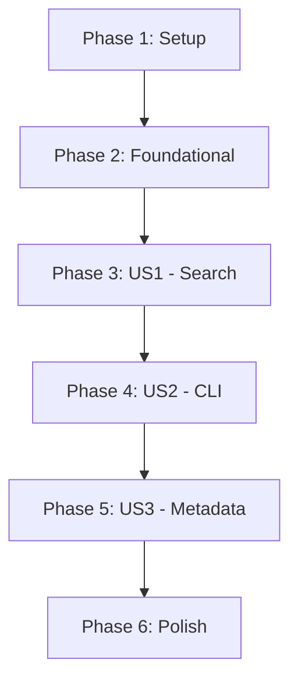

# Tasks: MCP Engram Server

**Feature**: MCP Engram Server  
**Branch**: `001-mcp-engram-server`  
**Status**: Completed  
**Plan**: [plan.md](plan.md) | **Spec**: [spec.md](spec.md)

## Implementation Strategy

We will implement the MCP server using the official Python `mcp` SDK. The server will be integrated into the existing `engram` CLI as a new command. The implementation follows an MVP-first approach, prioritizing the core search functionality (US1) before refining the metadata (US3) and CLI integration (US2).

## Phase 1: Setup

- [x] T001 Add `mcp[cli]` to dependencies in `pyproject.toml`
- [x] T002 [P] Create directory structure `src/engram/mcp/`
- [x] T003 Create `src/engram/mcp/__init__.py`

## Phase 2: Foundational (Blocking)

- [x] T004 Define the MCP server instance in `src/engram/mcp/server.py`
- [x] T005 Implement database and model initialization in `src/engram/mcp/server.py`
- [x] T006 [P] Create `tests/test_mcp.py` for mocking MCP tool calls

## Phase 3: User Story 1 - Semantic Search (P1)

**Story Goal**: Users can search engram memories from an MCP-capable assistant.
**Independent Test**: Run the server manually and use an MCP client (or inspector) to call `search_engram`.

- [x] T007 [US1] Define `search_engram` tool schema in `src/engram/mcp/tools.py`
- [x] T008 [US1] Implement semantic search logic in `src/engram/mcp/tools.py` using `lancedb`
- [x] T009 [US1] Implement basic text result formatting in `src/engram/mcp/tools.py`
- [x] T010 [US1] Register `search_engram` tool with the server in `src/engram/mcp/server.py`

## Phase 4: User Story 2 - Easy Configuration (P2)

**Story Goal**: Users can start the server via `engram mcp`.
**Independent Test**: Execute `engram mcp` and verify it hangs/listens on stdio.

- [x] T011 [US2] Add `mcp` command to `src/engram/main.py` using Typer
- [x] T012 [US2] Implement error handling and return MCP error response for missing database in `src/engram/mcp/server.py`
- [x] T013 [US2] Implement error handling and return MCP error response for model loading failures in `src/engram/mcp/server.py`
- [x] T014 [US2] Implement retry logic or informative error for database lock scenarios in `src/engram/mcp/server.py`

## Phase 5: User Story 3 - Rich Metadata (P3)

**Story Goal**: Search results include timestamps and source information.
**Independent Test**: Verify metadata fields are present in the `TextContent` output.

- [x] T015 [US3] Update result formatting to include `source` and `timestamp` in `src/engram/mcp/tools.py`
- [x] T016 [US3] Add similarity score to the result output in `src/engram/mcp/tools.py`

## Phase 6: Polish & Cross-Cutting

- [x] T017 Implement logging to `stderr` for initialization steps in `src/engram/mcp/server.py`
- [x] T018 Ensure graceful shutdown on `SIGINT`/`SIGTERM` in `src/engram/mcp/server.py`
- [x] T019 Final manual verification with an MCP client (e.g., Cursor or MCP Inspector)
- [x] T020 [P] Implement automated soak test (100+ sequential queries) to verify SC-004 stability in `tests/test_mcp.py`

## Dependencies

## Parallel Execution Examples

### User Story 1 Parallelization
- T007 (Schema) and T008 (Logic) can be worked on simultaneously if the interface is agreed upon.
- T006 (Tests) can be developed in parallel with T007/T008.

### Documentation & Setup
- T001, T002, and T003 are trivial and can be executed as a single batch.
